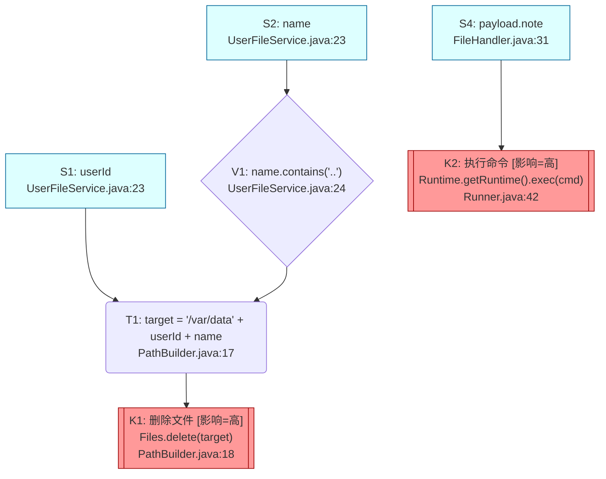

# 通用代码数据流与调用链分析

## 基本原则

1. **语言无关**。
2. **只陈述事实，不下安全结论**；是否构成风险由人工判断。
3. **完备性 > 简洁性**：多 source / 多 sink / 多路径全部列出。
4. **不确定的诚实标注**：用 `[未解析]` / `[外部]` / `[动态]` 等中文标签，不要瞎猜。

---

## 核心方法论

整体流程：**定位入口 → 识别 source / sink → 前向传播跟踪 → 相关 source 合并 → 路径汇总输出**。

### Step 1 — Sources

入口函数 `F` 的形参，加上 `F` 调用链上读到的外部数据（环境、命令行、stdin、HTTP/RPC 请求、配置、文件读入、IPC、反序列化对象、视上下文的 DB/RPC 返回值等）。每个 source 记：名称、类型、引入位置（文件:行）、引入方式。

### Step 2 — Sinks

每个 sink 的 **类别** 字段必填，从下表枚举中选取一项；不在此表或边界模糊的，标 `[未解析]` 并写入 Open Questions。**默认影响等级**跟随类别——仅 **反序列化** 一类按上下文判定（信源是否可信），其他类别不允许按上下文覆盖。

| 类别 | 默认影响 | 行为示例 |
|---|---|---|
| 执行命令 | 高 | shell exec / spawn / 进程启动 |
| 反序列化 | 高（不可信源）/ 低（可信本地）| JSON / YAML / XML / pickle / Java native ser 等解析 |
| 写文件 | 高 | write / append |
| 其他写文件 | 高 | 上表未涵盖的文件写（如 mmap 写、扩展属性、特殊设备） |
| 读文件 | 中 | read |
| 其他读文件 | 中 | 上表未涵盖的文件读 |
| 创建文件 | 高 | create / touch |
| 复制文件 | 高 | copy / sendfile / `cp` |
| 解压文件 | 高 | unzip / tar 解包 / archive extract |
| 压缩文件 | 高 | zip / tar 打包 / archive create |
| 删除文件 | 高 | delete / unlink |
| 文件改名 | 高 | rename / move |
| 修改文件权限 | 高 | chmod / chown / 设置 ACL |
| 获取目录列表 | 低 | listdir / scandir |
| 创建目录 | 中 | mkdir |
| 删除目录 | 高 | rmdir |
| 数据库查询 | 中 | SELECT / NoSQL get |
| 数据库写 | 高 | INSERT / UPDATE / DELETE / NoSQL put |
| 建立网络连接 | 中 | TCP connect / socket open |
| 发送网络请求 | 高 | TCP/UDP 发送数据 |
| 发送 HTTP 请求 | 高 | HTTP request |
| sftp 写操作 | 高 | sftp put / 远端写入 |
| sftp 读操作 | 中 | sftp get / 远端读取 |
| 其他网络写 | 高 | 上表未涵盖的对外写 |
| 其他网络读 | 中 | 上表未涵盖的对外读 |
| 加密 | 中 | encrypt |
| 解密 | 中 | decrypt |

**所有命中的 sink 都要列出**，与本次 source 无关的在条目末尾注明理由（`*(无污点：<理由>)*`），便于读者确认你考察过它。

### Step 3 — 前向传播跟踪

从每个 source 沿数据流走向 sink；途中保持以下处理：

- **跨函数**：调用项目内函数时进入实现继续跟，记录调用栈；外部库依据可查文档判断（透传 / 校验 / 转换 / 终止），不确定标 `[外部]`。
- **加载/执行外部文件**：代码若读取并解析、或加载执行（脚本 / 动态库 / 模板 / SQL / 配置）一个文件，且文件内容会**实质性影响本次分析**（脚本里的命令本身就是潜在 sink；配置里影响代码分支或拼到 sink 表达式里的字段会成为新的 source 或控制因子；模板会成为渲染输出的一部分），**有必要时打开该文件继续分析**——把它当作调用链的延伸。未打开 / 跳过 / 截断分析时，标 `[未解析]` 并写入 Open Questions。
- **派生不丢污点**：编码、转义、规范化、截断、字段读取、容器存取后仍带污点。
- **控制流**：分支会影响传播则分支处理，不做完整路径敏感展开。
- **终止**：命中 sink、值被丢弃、被抛错/return 吞掉、进入不可达的外部、循环收敛后即停止。

跟踪时在节点上记录两类信息：

#### (a) 关键校验

对污点变量做判断且改变控制流的操作：记位置、表达式、通过/未通过分支的去向。**不评价校验是否充分。**

#### (b) 关键转换

改变值形态但不丢污点：记操作类型 + 引入的常量部分。**到达 sink 时的最终表达式要尽量还原**（见模板）。

#### (c) 业务意图（每条 flow 必填）

每条 flow 用 1–3 句自然语言说明在业务上做什么、关键校验/转换在该业务里扮演什么角色；多 source 时分别说明各自角色。**不评价是否充分或安全。**

### Step 4 — 相关 Source 合并

业务上紧密相关、沿同一调用链流向同一组 sink 的多个 source，合并到同一条 flow。**判断准则：拆开后是否会反复重述同一段链路？是 → 合并；否 → 各自独立。** 合并后的 flow 头用集合写法 `Flow F1: {S1, S2} → K1`。

### Step 5 — 方法核对记录

走入**任何**名字+签名暗示了明确契约的方法（utility 类的校验/规范化/编解码/解析是常见来源，但不限于此——领域方法、服务方法、内部 helper 同样适用），完整核对、行为与契约相符时，追加一条到 `methods-verified.md`（每核对完一个立即落盘）。下次分析撞到同样方法可直接引用，不必重做。

行为不符或未完整核对的不进此表——前者放 Open Questions 或在 flow 步骤里陈述，后者属于未完成。

---

## 输出形态

**输出一个目录，不是单个文件。** 目录名建议 `<入口函数名>-dataflow/`（用户已指定路径则尊重用户）。

- **简单**（1–2 条 flow、链路短）：目录里一个 `report.md`，所有内容内联。
- **复杂**（多 flow / 长链路 / 多 Open Questions）：

  ```
  <function>-dataflow/
  ├── summary.md          # 极简版（永远生成）
  ├── graph.md            # 传播链路图（节点 < 12）或索引页（≥ 12 时按 sink 分拆）
  ├── graph-K1.md         # （仅当分拆时）按 sink 切的子图
  ├── graph-K2.md
  ├── index.md            # 入口、Sources、Sinks、Flow 索引、Unreached、Open Questions
  ├── flow-F1.md          # 单条 Flow 完整描述，自包含
  ├── flow-F2.md
  └── methods-verified.md # 可选：方法核对记录（追加增量）
  ```

简单情形下目录里同时有 `report.md` / `summary.md` / `graph.md`；`methods-verified.md` 也单独成文件，不内联到 `report.md`——固定命名便于跨任务复用。

每分析完一条 flow / 一个独立小模块 / 一次方法核对就**立即落盘**，不要囤到最后。每条 flow 完成时，对应的极简块同时追写到 `summary.md`，相关节点和连边同时追写到 `graph.md`。

每个 `flow-Fx.md` **自包含**：重述本条涉及的 source / sink 摘要、调用链、步骤、校验、转换、最终表达式，不依赖 `index.md` 也能独立看懂。多条 flow 共用同一段代码时各自展开，让 flow 之间互不干扰。

---

## 输出格式（每个文件的结构必须严格遵守，示例使用 Java）

`graph.md` 使用 Mermaid `graph TD` 语法，GitHub / GitLab / 大多数 Markdown 阅读器内嵌渲染。

### `index.md`（或简单情形下的 `report.md`）

```markdown
# 数据流报告：UserFileService.deleteUserFile

## 入口
- 函数：`com.example.UserFileService#deleteUserFile(String userId, String name, User user)`
- 位置：`src/main/java/com/example/UserFileService.java:23`
- 语言：java

## 输入源（Sources）

| ID | 名称 | 类型 | 引入位置 | 来源 |
|---|---|---|---|---|
| S1 | `userId` | String | `UserFileService.java:23` | 方法形参 |
| S2 | `name` | String | `UserFileService.java:23` | 方法形参 |
| S3 | `APP_BASE_DIR` | String | `Config.java:14` | 环境变量 |
| S4 | `payload.note` | String | `FileHandler.java:31` | HTTP 请求体 |

## 命中的关键操作点（Sinks）

| ID | 类别 | 影响 | 调用 | 位置 | 备注 |
|---|---|---|---|---|---|
| K1 | 删除文件 | 高 | `Files.delete(target)` | `PathBuilder.java:18` | — |
| K2 | 执行命令 | 高 | `Runtime.getRuntime().exec(cmd)` | `Runner.java:42` | — |
| K3 | 写文件 | 高 | `Files.write(logPath, bytes)` | `AuditLog.java:27` | 无污点：`logPath` 由常量 `LOG_DIR` 与当前进程 PID 拼接 |

## 传播路径索引

| ID | Sources | Sink | 类别 | 影响 | 详情 |
|---|---|---|---|---|---|
| F1 | {S1, S2} | K1 | 删除文件 | 高 | `flow-F1.md` |
| F2 | S4 | K2 | 执行命令 | 高 | `flow-F2.md` |

> 简单情形（单文件 `report.md`）：把上面索引替换为各 flow 的完整章节内联展开（结构见下方 flow 文件模板的"业务意图"以下部分）。

## 未流出的输入源（Unreached Sources）
- S3（`APP_BASE_DIR`）：仅作为常量前缀使用，未传播到任何被跟踪的 sink 类型。

## 待确认问题（Open Questions）
- `PathBuilder#buildAndRemove` 内部调用 `com.thirdparty.fs.Cleaner.drop(target)`（来自 fs-helper 1.4）；`drop` 的行为未解析，此处当作终止 sink K1 处理。请确认 `drop` 是否还有额外校验。
- `FileHandler.java:31` 处的分支取决于运行时配置 `cfg.strictMode`；上述路径已枚举两个分支。
```

### `flow-Fx.md`

```markdown
# Flow F1：{S1, S2} → K1（删除文件）

## 摘要
- Source S1：参数 `userId`（String），引入于 `UserFileService.java:23`
- Source S2：参数 `name`（String），引入于 `UserFileService.java:23`
- Sink K1：`Files.delete(target)` 位于 `PathBuilder.java:18`，类别=删除文件，影响=高
- 调用链：`UserFileService#deleteUserFile` → `PathBuilder#buildAndRemove`
- 合并理由：`userId` 与 `name` 共同决定要删的文件位置，沿同一条调用链流向同一个 sink，拆开会反复重述同一段链路。

## 业务意图
该方法负责按 `userId` 定位用户在数据目录下的子目录，再删除其中名为 `name` 的文件。链路上 `name.contains("..")` 用于阻止跨目录引用；`Paths.get(BASE_DIR, userId, name)` 把最终路径锚定在常量基目录 `/var/data` 之下；`userId` 直接参与路径拼接，路径上未观察到对它的校验。

## 步骤

| # | 位置 | 类型 | 动作 |
|---|---|---|---|
| 1 | `UserFileService.java:24` | 校验 | `if (name.contains("..")) throw new IllegalArgumentException("bad name")`（命中→抛错；未命中→继续；`userId` 此处未参与） |
| 2 | `UserFileService.java:27` | 调用 | `PathBuilder.buildAndRemove(userId, name)`（跨方法，污点跟随到形参 `u`、`n`） |
| 3 | `PathBuilder.java:17` | 转换 | `Path target = Paths.get(BASE_DIR, u, n)`（与常量 `BASE_DIR="/var/data"` 三段拼接） |
| 4 | `PathBuilder.java:18` | sink | `Files.delete(target)`（命中 K1） |

`类型` 为受控值：赋值 / 校验 / 转换 / 调用 / sink。

## 路径上的校验

| ID | 位置 | 表达式 | 命中处理 | 作用于 |
|---|---|---|---|---|
| V1 | `UserFileService.java:24` | `name.contains("..")` | 抛 IllegalArgumentException | S2=`name`（S1=`userId` 未参与） |

## 路径上的转换

| ID | 位置 | 操作 | 表达式 |
|---|---|---|---|
| T1 | `PathBuilder.java:17` | 路径拼接 | `Paths.get(<常量 "/var/data">, <带污点 userId>, <带污点 name>)` |

## 到达 sink 时的最终表达式
`Files.delete(Paths.get("/var/data", userId, name))`，其中 `name` 前置经过 V1，`userId` 未经过校验。

## 备注
无。
```

### `graph.md`（永远生成）

**审计入口图**——只画对快速识别问题有增量信息的节点，**不求完备**（完备版在 `index.md` 的表与 `flow-Fx.md` 里已有）。

**保留**：
- 流到至少一个 sink 的 source（reached）
- 至少有一条污点流到达的 sink（tainted）
- **对内容有约束**的校验：字符串内容匹配（`contains`/`startsWith`/正则/白名单/黑名单）、规范化后比较（`realpath` + `startsWith(base)`）、签名/鉴权、自定义业务规则
- **改 sink 表达式形态**的转换：与常量拼接（路径/URL/SQL）、编码/转义、解析、实际起过滤作用的截断/替换

**丢弃**（硬过滤清单——这些**永不进图**，但仍在 `flow-Fx.md` 的表里完整记录）：
- null 检查（`x == null` / `Objects.requireNonNull`）
- 空串检查（`isEmpty` / `isBlank`）
- 类型检查（`instanceof`）、长度下限（避免 IOB 用，非内容约束）
- 解析格式失败提前 return（`Integer.parseInt` 抛 NFE 被 catch 等）
- 纯类型转换（`String.valueOf` / `toString`）、内部字段拷贝、调试性 `trim`
- unreached source、untainted sink

**失败分支若退出入口函数则不画**：校验失败若导致 throw / return / sys.exit 退出入口函数（污点不再到达任何 sink），该失败边**省略不画**——校验节点本身保留，只画"通过/继续"出边。失败分支若去到别处（设置默认值、走另一条 sink、清理后继续等）才画出。这样读者眼睛只跟"到达 sink 的活路径"，死胡同不再占视觉。



读图约定：
- **形状**：矩形=source、菱形=校验、圆角矩形=转换、带阴影矩形=sink。
- **配色**：source 蓝；sink 按影响 encode（高=红 high、中=黄 mid、低=灰 low）；校验/转换默认色。
- **代码块注释**：用 `%% Flow Fx: ... → Kn` 分段维护每条 flow 的连边，便于追加。

**超阈值分拆**：图里**节点数 ≥ 12** 时，按 **sink 切分**——每个 sink 一个 `graph-K<n>.md`，里面只画通向该 sink 的 source / V / T 子图。`graph.md` 退化为索引页：

```markdown
# 传播链路图（已按 sink 分拆）

节点数超过阈值，按 sink 切分：
- `graph-K1.md` — 删除文件 [影响=高] ← {S1, S2}
- `graph-K2.md` — 执行命令 [影响=高] ← {S4}

（unreached source / untainted sink 见 `index.md` 对应表，不进图）
```

### `summary.md`（永远生成）

每条 flow 一个块，仅含：源 → sink + 关键校验代码片段。**不写**调用链、业务意图、转换、Unreached、Open Questions、备注，也不列与污点无关的 sink。仅作"五秒扫一遍主线"用。

```markdown
# 极简数据流报告：UserFileService.deleteUserFile

## F1：{userId, name} → 删除文件 (Files.delete) [影响=高]
- **Sink** `PathBuilder.java:18`：`Files.delete(Paths.get("/var/data", userId, name))`
- **校验**：
  - `UserFileService.java:24`：`if (name.contains("..")) throw new IllegalArgumentException("bad name")`
  - `userId` 无校验

## F2：payload.note → 执行命令 (Runtime.exec) [影响=高]
- **Sink** `Runner.java:42`：`Runtime.getRuntime().exec(cmd)`
- **校验**：路径上无校验
```

模板规则：

- 标题行：`## F<n>：{<source 标识符...>} → <sink 类别> (<最关键 API>) [影响=高/中/低]`。单 source 时去掉花括号。
- **Sink** 行：位置 + sink 处的最终表达式形式（能一行写下就一行）。
- **校验** 行：每条校验的位置和代码片段；某 source 路径上无校验显式写出 "`<source>` 无校验"；整条 flow 都没校验写 "路径上无校验"。

### `methods-verified.md`

```markdown
# 方法核对记录

> 此文件追加增量；每条记录一个被核对过、实现与名称契约相符的方法（utility / 领域 / 服务 / helper 皆可）。
> 后续分析撞到同样方法时可直接引用本文件，无需重新核对。

## com.example.IpUtils#isValidIpv4(String s)
- 位置：`src/main/java/com/example/IpUtils.java:12`
- 预期行为：校验输入是否为四段、每段 0–255 的 IPv4 字面量字符串
- 实际逻辑：按 `.` 切分后长度=4；每段 `Integer.parseInt` 后判断 0–255；非数字段抛 `NumberFormatException` 被 catch 后返回 false
- 边界：`null` → 提前返回 false；空串 → false；前置零如 `"01.0.0.0"` 按数字解析仍接受
- 结论：符合预期，可作 IPv4 字面量校验使用
```

五项字段固定；"结论"用"符合预期，…"句式开头便于跨任务检索。

---

## 风格与禁忌

- **不要**给修复建议。
- **不要**在事实里夹议论；提示统一放在 `Open Questions` 中以问题形式表述。
- **不要**用模糊量词（"很多"、"大量"、"看起来"）。具体到 `文件:行` 和表达式。
